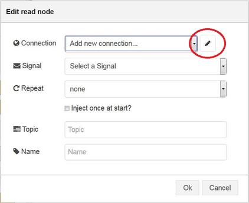
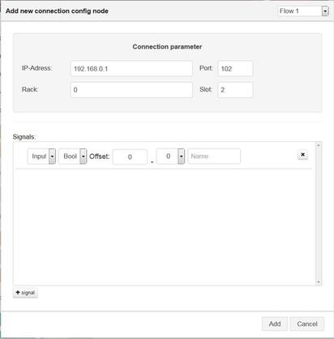
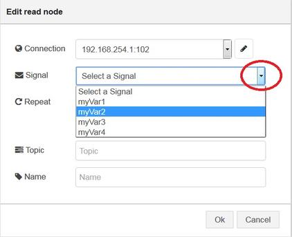
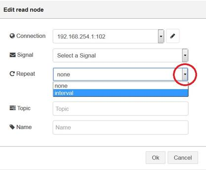

## Overview

 - [Function of the S7comm node](#Function)
 - [configuration node](#configuration)
 - [Read node](#read)
 - [Write node](#write)
 - [JSON structures](#JSON)
 - [Example payloads for read commands](#ReadCommands)
 - [Example payloads for write commands](#WriteCommands)

##  Function of the S7comm node
-----------

The S7comm-Read sends an reading request to a sps. The responde from the PLC is at the output of the node available as soon as its arrived.The nodes reads a value from the PLC triggered internally or by an inject node.

The S7comm-Write node writes an value to a Memory of an SPS. The Value is provides either from the inject Node or from an S7comm-Read node.

##  configuration node
-----------
To parametrise the configuration node you have to insert either a S7comm-Read or a S7comm-Write node into the Node-RED editor by dragging it from the list on the left hand side and drop it onto the editor window.

*Open Edit Dialog*

After double clicking the node you are in the edit dialog of the S7comm node (both nodes are looking nearly the same). The following edit dialog will pop up. Here you can open the Configuration Node.
        

*Open Configuration Node*

The Configuration Node consists of two parts. In the first part you can edit the S7comm-Connection parameter (IP,Port,Rack,Slot). The second part is the signal box. The signal box represents a global list of your SPS. This global list is available for all reading and writing nodes. After creating a global signal list push "Add" to apply the Connection parameter and create the list for all S7comm nodes.
       

*How to define an signal*

I0.1: 

IB0 - IB3:

 

DB10,DBB0:

 

T0: 

##  Read node
-----------
1) Select an item of the global list you want to read

2) Select the repeating mechanism (similar to inject node)
 In case of choosing the intervall functionallity decide for a repeating time

3) Choose a name  and a topic for your Node and confirm the Node with OK.

##  Write node
-----------
1) Select an item of the global list you want to write

2) Choose a name for your Node and confirm the Node

##  JSON structures
-----------
General structure:
The node outputs a msg.payload in the following format to show the read/write command.
The value Field for the read node shows the reading value. The value Field for the write node shows the writing value!

    payload.signal : Symbolic name of the signal as configured,
    payload.path  : Signal path of the data,
    payload.error : Error value: 0 = no error, -1 = any error,
    payload.value : Read/Written Value as an array

Special definition for *payload.value : Read/Written Value within an Array*

&nbsp;&nbsp;&nbsp;&nbsp; null: in case of an error;

&nbsp;&nbsp;&nbsp;&nbsp; single value: if the quantity equals to one;

&nbsp;&nbsp;&nbsp;&nbsp; array of values: if the quantity is larger than one;

The message at the output of the node has a defined JSON structures:

Example:
{
    topic: "myTopic",
    payload: {
        signal: "myVar",
        path: "MB0",
        error:0,
        value: [42]
    },
    _msgid: "ee4d0428.11b2f8"
}

##   Example payloads for read commands
-----------
Reading Q0.1, return value is true and valid:

    {topic:"Input_hall#1", payload:{signal: "machine#1", path:"Q0.1",error:0, value:[true] }, _msgid: "92e3f0cc.6d1c1" }

Reading QB1, return value is 100 and valid:

    {topic:"Input_hall#1", payload:{signal: "machine#1", path:"QB1",error:0, value:[100] }, _msgid: "92e3f0cc.6d1c1" }

Reading QB0-QB3, return value is [1,2,3,4] and valid:

    {topic:"Input_hall#1", payload:{signal: "machine#1", path:"QB0..3",error:0, value:[1,2,3,4] }, _msgid: "92e3f0cc.6d1c1" }

Reading DB11.DBB0 - DB11.DBB3, return value is [null,null,null,null] and invalid because DB11 does not exist:

    {topic:"Input_hall#1", payload:{signal: "machine#1", path:"DB10,BYTE0..3",error:-1, value:[null,null,null,null] }, _msgid: "92e3f0cc.6d1c1" }

In any case of Error:

    error=-1, value=[null]

##   Example payloads for write commands
-----------
Writing true to I0.3, writing succeeded, Error equals to 0:

    {topic:"Input_hall#1", payload:{signal: "machine#1", path:"I0.3",error:0, value:[true] }, "_msgid": "92e3f0cc.6d1c1" }

Writing 8 to IB1, writing succeeded, Error equals to 0:

    {topic:"Input_hall#1", payload:{signal: "machine#1", path:"IB1",error:0, value:[8] }, "_msgid": "92e3f0cc.6d1c1" }

Writing [1,2,3] to IB1-IB3, writing succeeded, Error equals to 0:

    {topic:"Input_hall#1", payload:{signal: "machine#1", path:"IB1..3",error:0, value:[1,2,3]}, _msgid: "92e3f0cc.6d1c1" }

Writing 8 to IB1, Writing failed, Error equals to -1:

    {topic:"Input_hall#1", payload:{signal: "machine#1", path:"IB1",error:-1, value:[8]}, _msgid: "92e3f0cc.6d1c2" }

**Important Note: When using an inject node use following JSON formats:**

    for boolean value: {"value":[true]}
    
    for single value: {"value":[1]}

    for array value: {"value":[1,2,3]}

    for Character value:{"value":["S"]}

    for string value:{"value":["Simatic"]}

**Example Flow:**
<pre><code>
[{"id":"46d00a53.39200c","type":"s7comm read","z":"6c34b25d.11e1e4","connection":"6baee175.d2a1f","globallist":{"items":[{"S7_itemID":"HaIhPSsr","S7_Type":"M","S7_DBnum":"0","S7_Datatype":"X","S7_Offset":"0","S7_BitOffset":"0","S7_Quantity":"1","S7_Name":"test1_M0.0"},{"S7_itemID":"MPNcVSwT","S7_Type":"M","S7_DBnum":"0","S7_Datatype":"B","S7_Offset":"0","S7_BitOffset":"0","S7_Quantity":"1","S7_Name":"test2_MB0"},{"S7_itemID":"itJXkiyV","S7_Type":"M","S7_DBnum":"0","S7_Datatype":"W","S7_Offset":"0","S7_BitOffset":"0","S7_Quantity":"1","S7_Name":"test3_MW0"},{"S7_itemID":"8E7zzoX5","S7_Type":"M","S7_DBnum":"0","S7_Datatype":"D","S7_Offset":"0","S7_BitOffset":"0","S7_Quantity":"1","S7_Name":"test4_MD0"}]},"payload":"{\"S7_Type\":\"M\",\"S7_DBnum\":\"0\",\"S7_Datatype\":\"X\",\"S7_Offset\":\"0\",\"S7_BitOffset\":\"0\",\"S7_Quantity\":\"1\",\"S7_Name\":\"test1_M0.0\"}","s7Name":"test1_M0.0","topic":"read:M0.0","name":"","signalSetted":false,"none":"true","repeat":"","once":false,"x":430,"y":249,"wires":[["4032de75.a55f18","c4a21e2e.d11fc"]]},{"id":"5dfed93c.8287","type":"s7comm write","z":"6c34b25d.11e1e4","connection":"6baee175.d2a1f","globallist":{"items":[{"S7_itemID":"HaIhPSsr","S7_Type":"M","S7_DBnum":"0","S7_Datatype":"X","S7_Offset":"0","S7_BitOffset":"0","S7_Quantity":"1","S7_Name":"test1_M0.0"},{"S7_itemID":"MPNcVSwT","S7_Type":"M","S7_DBnum":"0","S7_Datatype":"B","S7_Offset":"0","S7_BitOffset":"0","S7_Quantity":"1","S7_Name":"test2_MB0"},{"S7_itemID":"itJXkiyV","S7_Type":"M","S7_DBnum":"0","S7_Datatype":"W","S7_Offset":"0","S7_BitOffset":"0","S7_Quantity":"1","S7_Name":"test3_MW0"},{"S7_itemID":"8E7zzoX5","S7_Type":"M","S7_DBnum":"0","S7_Datatype":"D","S7_Offset":"0","S7_BitOffset":"0","S7_Quantity":"1","S7_Name":"test4_MD0"}]},"payload":"{\"S7_Type\":\"M\",\"S7_DBnum\":\"0\",\"S7_Datatype\":\"W\",\"S7_Offset\":\"0\",\"S7_BitOffset\":\"0\",\"S7_Quantity\":\"1\",\"S7_Name\":\"test3_MW0\"}","s7Name":"test3_MW0","topic":"","name":"write:MW0","signalSetted":false,"x":570,"y":826,"wires":[["e34913d5.a34f3"]]},{"id":"daaffcea.56228","type":"s7comm read","z":"6c34b25d.11e1e4","connection":"6baee175.d2a1f","globallist":{"items":[{"S7_itemID":"HaIhPSsr","S7_Type":"M","S7_DBnum":"0","S7_Datatype":"X","S7_Offset":"0","S7_BitOffset":"0","S7_Quantity":"1","S7_Name":"test1_M0.0"},{"S7_itemID":"MPNcVSwT","S7_Type":"M","S7_DBnum":"0","S7_Datatype":"B","S7_Offset":"0","S7_BitOffset":"0","S7_Quantity":"1","S7_Name":"test2_MB0"},{"S7_itemID":"itJXkiyV","S7_Type":"M","S7_DBnum":"0","S7_Datatype":"W","S7_Offset":"0","S7_BitOffset":"0","S7_Quantity":"1","S7_Name":"test3_MW0"},{"S7_itemID":"8E7zzoX5","S7_Type":"M","S7_DBnum":"0","S7_Datatype":"D","S7_Offset":"0","S7_BitOffset":"0","S7_Quantity":"1","S7_Name":"test4_MD0"}]},"payload":"{\"S7_Type\":\"M\",\"S7_DBnum\":\"0\",\"S7_Datatype\":\"B\",\"S7_Offset\":\"0\",\"S7_BitOffset\":\"0\",\"S7_Quantity\":\"1\",\"S7_Name\":\"test2_MB0\"}","s7Name":"test2_MB0","topic":"read:MB0","name":"","signalSetted":false,"none":"false","repeat":"1","once":false,"x":420,"y":120,"wires":[["cad554fe.67d04","89ece49a.88869"]]},{"id":"795ced73.604d3c","type":"s7comm read","z":"6c34b25d.11e1e4","connection":"6baee175.d2a1f","globallist":{"items":[{"S7_itemID":"HaIhPSsr","S7_Type":"M","S7_DBnum":"0","S7_Datatype":"X","S7_Offset":"0","S7_BitOffset":"0","S7_Quantity":"1","S7_Name":"test1_M0.0"},{"S7_itemID":"MPNcVSwT","S7_Type":"M","S7_DBnum":"0","S7_Datatype":"B","S7_Offset":"0","S7_BitOffset":"0","S7_Quantity":"1","S7_Name":"test2_MB0"},{"S7_itemID":"itJXkiyV","S7_Type":"M","S7_DBnum":"0","S7_Datatype":"W","S7_Offset":"0","S7_BitOffset":"0","S7_Quantity":"1","S7_Name":"test3_MW0"},{"S7_itemID":"8E7zzoX5","S7_Type":"M","S7_DBnum":"0","S7_Datatype":"D","S7_Offset":"0","S7_BitOffset":"0","S7_Quantity":"1","S7_Name":"test4_MD0"}]},"payload":"{\"S7_Type\":\"M\",\"S7_DBnum\":\"0\",\"S7_Datatype\":\"W\",\"S7_Offset\":\"0\",\"S7_BitOffset\":\"0\",\"S7_Quantity\":\"1\",\"S7_Name\":\"test3_MW0\"}","s7Name":"test3_MW0","topic":"read:MW0","name":"","signalSetted":false,"none":"true","repeat":"","once":false,"x":430,"y":329,"wires":[["bf77c04c.4a7ac","c161544b.774c1"]]},{"id":"23f45a96.04fa66","type":"s7comm read","z":"6c34b25d.11e1e4","connection":"6baee175.d2a1f","globallist":{"items":[{"S7_itemID":"HaIhPSsr","S7_Type":"M","S7_DBnum":"0","S7_Datatype":"X","S7_Offset":"0","S7_BitOffset":"0","S7_Quantity":"1","S7_Name":"test1_M0.0"},{"S7_itemID":"MPNcVSwT","S7_Type":"M","S7_DBnum":"0","S7_Datatype":"B","S7_Offset":"0","S7_BitOffset":"0","S7_Quantity":"1","S7_Name":"test2_MB0"},{"S7_itemID":"itJXkiyV","S7_Type":"M","S7_DBnum":"0","S7_Datatype":"W","S7_Offset":"0","S7_BitOffset":"0","S7_Quantity":"1","S7_Name":"test3_MW0"},{"S7_itemID":"8E7zzoX5","S7_Type":"M","S7_DBnum":"0","S7_Datatype":"D","S7_Offset":"0","S7_BitOffset":"0","S7_Quantity":"1","S7_Name":"test4_MD0"}]},"payload":"{\"S7_Type\":\"M\",\"S7_DBnum\":\"0\",\"S7_Datatype\":\"D\",\"S7_Offset\":\"0\",\"S7_BitOffset\":\"0\",\"S7_Quantity\":\"1\",\"S7_Name\":\"test4_MD0\"}","s7Name":"test4_MD0","topic":"read:MD0","name":"","signalSetted":false,"none":"true","repeat":"","once":false,"x":420,"y":409,"wires":[["77332d34.45009c","1f1048aa.c4361f"]]},{"id":"4032de75.a55f18","type":"debug","z":"6c34b25d.11e1e4","name":"","active":false,"console":"false","complete":"false","x":610,"y":269,"wires":[]},{"id":"cad554fe.67d04","type":"debug","z":"6c34b25d.11e1e4","name":"","active":false,"console":"false","complete":"false","x":610,"y":140,"wires":[]},{"id":"bf77c04c.4a7ac","type":"debug","z":"6c34b25d.11e1e4","name":"","active":false,"console":"false","complete":"false","x":610,"y":349,"wires":[]},{"id":"77332d34.45009c","type":"debug","z":"6c34b25d.11e1e4","name":"","active":false,"console":"false","complete":"false","x":610,"y":429,"wires":[]},{"id":"df80eff0.6323e","type":"s7comm read","z":"6c34b25d.11e1e4","connection":"6baee175.d2a1f","globallist":{"items":[{"S7_itemID":"HaIhPSsr","S7_Type":"M","S7_DBnum":"0","S7_Datatype":"X","S7_Offset":"0","S7_BitOffset":"0","S7_Quantity":"1","S7_Name":"test1_M0.0"},{"S7_itemID":"MPNcVSwT","S7_Type":"M","S7_DBnum":"0","S7_Datatype":"B","S7_Offset":"0","S7_BitOffset":"0","S7_Quantity":"1","S7_Name":"test2_MB0"},{"S7_itemID":"itJXkiyV","S7_Type":"M","S7_DBnum":"0","S7_Datatype":"W","S7_Offset":"0","S7_BitOffset":"0","S7_Quantity":"1","S7_Name":"test3_MW0"},{"S7_itemID":"8E7zzoX5","S7_Type":"M","S7_DBnum":"0","S7_Datatype":"D","S7_Offset":"0","S7_BitOffset":"0","S7_Quantity":"1","S7_Name":"test4_MD0"}]},"payload":"{\"S7_Type\":\"M\",\"S7_DBnum\":\"0\",\"S7_Datatype\":\"B\",\"S7_Offset\":\"0\",\"S7_BitOffset\":\"0\",\"S7_Quantity\":\"1\",\"S7_Name\":\"test2_MB0\"}","s7Name":"test2_MB0","topic":"read:MB0","name":"","signalSetted":false,"none":"true","repeat":"","once":false,"x":380,"y":746,"wires":[["5dfed93c.8287","22165752.705fd8"]]},{"id":"2c869135.19a7f6","type":"inject","z":"6c34b25d.11e1e4","name":"","topic":"","payload":"","payloadType":"date","repeat":"","crontab":"","once":false,"x":220,"y":746,"wires":[["df80eff0.6323e"]]},{"id":"e34913d5.a34f3","type":"debug","z":"6c34b25d.11e1e4","name":"","active":true,"console":"false","complete":"false","x":750,"y":826,"wires":[]},{"id":"ba094f3d.4c5c","type":"comment","z":"6c34b25d.11e1e4","name":"cyclic read: 3sec","info":"","x":230,"y":80,"wires":[]},{"id":"6fc0fbe5.42c5a4","type":"s7comm write","z":"6c34b25d.11e1e4","connection":"6baee175.d2a1f","globallist":{"items":[{"S7_itemID":"HaIhPSsr","S7_Type":"M","S7_DBnum":"0","S7_Datatype":"X","S7_Offset":"0","S7_BitOffset":"0","S7_Quantity":"1","S7_Name":"test1_M0.0"},{"S7_itemID":"MPNcVSwT","S7_Type":"M","S7_DBnum":"0","S7_Datatype":"B","S7_Offset":"0","S7_BitOffset":"0","S7_Quantity":"1","S7_Name":"test2_MB0"},{"S7_itemID":"itJXkiyV","S7_Type":"M","S7_DBnum":"0","S7_Datatype":"W","S7_Offset":"0","S7_BitOffset":"0","S7_Quantity":"1","S7_Name":"test3_MW0"},{"S7_itemID":"8E7zzoX5","S7_Type":"M","S7_DBnum":"0","S7_Datatype":"D","S7_Offset":"0","S7_BitOffset":"0","S7_Quantity":"1","S7_Name":"test4_MD0"}]},"payload":"{\"S7_Type\":\"M\",\"S7_DBnum\":\"0\",\"S7_Datatype\":\"X\",\"S7_Offset\":\"0\",\"S7_BitOffset\":\"0\",\"S7_Quantity\":\"1\",\"S7_Name\":\"test1_M0.0\"}","s7Name":"test1_M0.0","topic":"","name":"write:M0.0","signalSetted":false,"x":430,"y":540,"wires":[["61b02cd9.1a22f4"]]},{"id":"61b02cd9.1a22f4","type":"debug","z":"6c34b25d.11e1e4","name":"","active":true,"console":"false","complete":"false","x":610,"y":540,"wires":[]},{"id":"ff18da74.ba8a28","type":"s7comm write","z":"6c34b25d.11e1e4","connection":"6baee175.d2a1f","globallist":{"items":[{"S7_itemID":"HaIhPSsr","S7_Type":"M","S7_DBnum":"0","S7_Datatype":"X","S7_Offset":"0","S7_BitOffset":"0","S7_Quantity":"1","S7_Name":"test1_M0.0"},{"S7_itemID":"MPNcVSwT","S7_Type":"M","S7_DBnum":"0","S7_Datatype":"B","S7_Offset":"0","S7_BitOffset":"0","S7_Quantity":"1","S7_Name":"test2_MB0"},{"S7_itemID":"itJXkiyV","S7_Type":"M","S7_DBnum":"0","S7_Datatype":"W","S7_Offset":"0","S7_BitOffset":"0","S7_Quantity":"1","S7_Name":"test3_MW0"},{"S7_itemID":"8E7zzoX5","S7_Type":"M","S7_DBnum":"0","S7_Datatype":"D","S7_Offset":"0","S7_BitOffset":"0","S7_Quantity":"1","S7_Name":"test4_MD0"}]},"payload":"{\"S7_Type\":\"M\",\"S7_DBnum\":\"0\",\"S7_Datatype\":\"B\",\"S7_Offset\":\"0\",\"S7_BitOffset\":\"0\",\"S7_Quantity\":\"1\",\"S7_Name\":\"test2_MB0\"}","s7Name":"test2_MB0","topic":"","name":"write:MB0","signalSetted":false,"x":430,"y":620,"wires":[["28b1d6d8.549d92"]]},{"id":"28b1d6d8.549d92","type":"debug","z":"6c34b25d.11e1e4","name":"","active":true,"console":"false","complete":"false","x":610,"y":620,"wires":[]},{"id":"953fc166.3d06b8","type":"inject","z":"6c34b25d.11e1e4","name":"","topic":"","payload":"{\"value\":[true]}","payloadType":"json","repeat":"","crontab":"","once":false,"x":230,"y":520,"wires":[["6fc0fbe5.42c5a4"]]},{"id":"59246a42.8350bc","type":"inject","z":"6c34b25d.11e1e4","name":"","topic":"","payload":"{\"value\":[false]}","payloadType":"json","repeat":"","crontab":"","once":false,"x":240,"y":560,"wires":[["6fc0fbe5.42c5a4"]]},{"id":"f59bb61b.62c9f","type":"inject","z":"6c34b25d.11e1e4","name":"","topic":"","payload":"{\"value\":[100]}","payloadType":"json","repeat":"","crontab":"","once":false,"x":230,"y":600,"wires":[["ff18da74.ba8a28"]]},{"id":"7a295600.cdab28","type":"inject","z":"6c34b25d.11e1e4","name":"","topic":"","payload":"{\"value\":[200]}","payloadType":"json","repeat":"","crontab":"","once":false,"x":230,"y":640,"wires":[["ff18da74.ba8a28"]]},{"id":"ac32f5c6.11f9b","type":"comment","z":"6c34b25d.11e1e4","name":"write","info":"","x":190,"y":480,"wires":[]},{"id":"1bac554.264622b","type":"comment","z":"6c34b25d.11e1e4","name":"triggered read","info":"","x":210,"y":209,"wires":[]},{"id":"659d3a3b.b2868c","type":"inject","z":"6c34b25d.11e1e4","name":"","topic":"","payload":"","payloadType":"date","repeat":"","crontab":"","once":false,"x":220,"y":249,"wires":[["46d00a53.39200c"]]},{"id":"ece1d3ca.c9455","type":"inject","z":"6c34b25d.11e1e4","name":"","topic":"","payload":"","payloadType":"date","repeat":"","crontab":"","once":false,"x":220,"y":329,"wires":[["795ced73.604d3c"]]},{"id":"9f0aef13.ef0f68","type":"inject","z":"6c34b25d.11e1e4","name":"","topic":"","payload":"","payloadType":"date","repeat":"","crontab":"","once":false,"x":220,"y":409,"wires":[["23f45a96.04fa66"]]},{"id":"a0b03c85.ad12f","type":"comment","z":"6c34b25d.11e1e4","name":"R/W combination: (trigger reading manually)","info":"","x":310,"y":706,"wires":[]},{"id":"e530ea7e.91547","type":"comment","z":"6c34b25d.11e1e4","name":"value can be used for writing nodes.","info":"","x":640,"y":786,"wires":[]},{"id":"c4a21e2e.d11fc","type":"debug","z":"6c34b25d.11e1e4","name":"","active":true,"console":"false","complete":"payload.value","x":630,"y":229,"wires":[]},{"id":"89ece49a.88869","type":"debug","z":"6c34b25d.11e1e4","name":"","active":true,"console":"false","complete":"payload.value","x":630,"y":100,"wires":[]},{"id":"c161544b.774c1","type":"debug","z":"6c34b25d.11e1e4","name":"","active":true,"console":"false","complete":"payload.value","x":630,"y":309,"wires":[]},{"id":"1f1048aa.c4361f","type":"debug","z":"6c34b25d.11e1e4","name":"","active":true,"console":"false","complete":"payload.value","x":630,"y":389,"wires":[]},{"id":"9f78d0ac.abd8b","type":"comment","z":"6c34b25d.11e1e4","name":"readme","info":"This is an example flow how s7comm can be \nused. Please adapt the IP-address within \nthe configuration. \n\n**Note:**\n\nAfter adapting the \nIP or any signal you need to choose the \nsignalname within the selectbox of each node again ","x":110,"y":40,"wires":[]},{"id":"22165752.705fd8","type":"debug","z":"6c34b25d.11e1e4","name":"","active":true,"console":"false","complete":"false","x":570,"y":746,"wires":[]},{"id":"1a54d1a7.528186","type":"inject","z":"6c34b25d.11e1e4","name":"","topic":"","payload":"","payloadType":"date","repeat":"","crontab":"","once":false,"x":220,"y":120,"wires":[["daaffcea.56228"]]},{"id":"6baee175.d2a1f","type":"s7comm","z":"","ip":"192.168.254.232","port":"102","rack":"0","slot":"2","payload":[{"S7_itemID":"HaIhPSsr","S7_Type":"M","S7_DBnum":"0","S7_Datatype":"X","S7_Offset":"0","S7_BitOffset":"0","S7_Quantity":"1","S7_Name":"test1_M0.0"},{"S7_itemID":"MPNcVSwT","S7_Type":"M","S7_DBnum":"0","S7_Datatype":"B","S7_Offset":"0","S7_BitOffset":"0","S7_Quantity":"1","S7_Name":"test2_MB0"},{"S7_itemID":"itJXkiyV","S7_Type":"M","S7_DBnum":"0","S7_Datatype":"W","S7_Offset":"0","S7_BitOffset":"0","S7_Quantity":"1","S7_Name":"test3_MW0"},{"S7_itemID":"8E7zzoX5","S7_Type":"M","S7_DBnum":"0","S7_Datatype":"D","S7_Offset":"0","S7_BitOffset":"0","S7_Quantity":"1","S7_Name":"test4_MD0"}],"globallist":null}]
</code></pre>
